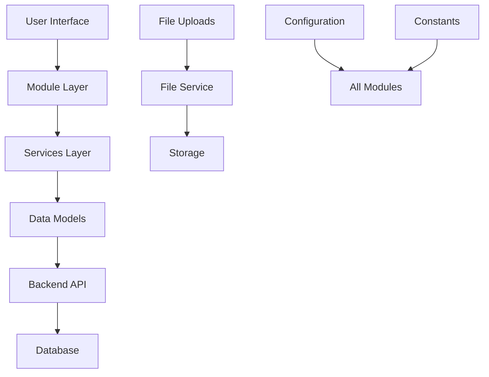

# EventIQ Management System - Project Architecture

## 📁 Complete Project Structure

```
eventiq-ai/
├── 📄 Configuration & Documentation
│   ├── README.md                    # Main project documentation
│   ├── .env.example                 # Environment variables template
│   ├── requirements.txt             # Python dependencies
│   ├── docker-compose.yml           # Docker deployment
│   └── Dockerfile                   # Container configuration
│
├── 📚 Documentation
│   ├── docs/
│   │   ├── PROJECT_ARCHITECTURE.md  # This file
│   │   ├── API_DOCUMENTATION.md     # API endpoint documentation
│   │   ├── DEPLOYMENT_GUIDE.md      # Deployment instructions
│   │   └── USER_MANUAL.md           # End-user documentation
│   ├── TEAM_COLLABORATION_GUIDE.md  # Team development workflow
│   ├── COMPLETE_DEMO_WALKTHROUGH.md # Demo instructions
│   └── PROJECT_STATUS.md            # Current status and roadmap
│
├── 🖥️ Frontend Application
│   ├── main_modular.py              # Main Streamlit application
│   ├── enhanced_frontend.py         # Legacy monolithic version (backup)
│   └── demo_launcher.py             # Demo environment launcher
│
├── 🧩 Modular Architecture
│   ├── modules/
│   │   ├── 🔧 Core Infrastructure
│   │   │   ├── __init__.py          # Package initialization
│   │   │   ├── config.py            # Configuration management
│   │   │   ├── constants.py         # Constants and enumerations
│   │   │   └── utils.py             # Shared utilities
│   │   │
│   │   ├── 📊 Data Layer
│   │   │   ├── models/
│   │   │   │   └── __init__.py      # Data models and schemas
│   │   │   └── services/
│   │   │       └── file_service.py  # File handling service
│   │   │
│   │   ├── 🏠 Core Features (8 Main Modules)
│   │   │   ├── dashboard.py         # Role-based dashboards
│   │   │   ├── certificates.py      # Certificate management
│   │   │   ├── media_gallery.py     # Media uploads & gallery
│   │   │   ├── vendors.py           # Vendor management
│   │   │   ├── participants.py      # Participant management
│   │   │   ├── budget.py            # Budget & expense tracking
│   │   │   ├── settings.py          # System configuration
│   │   │   └── additional_modules.py # Legacy compatibility
│   │   │
│   │   └── 🔄 Extended Features (5 Additional Modules)
│   │       ├── volunteers.py        # Volunteer management
│   │       ├── booths.py            # Booth & venue management
│   │       ├── workflows.py         # Process automation
│   │       ├── feedback.py          # Feedback collection
│   │       └── analytics.py         # Analytics & reporting
│   │
├── 🔧 Backend API
│   ├── app/
│   │   ├── main.py                  # FastAPI application
│   │   ├── api/v1/                  # API routes
│   │   ├── core/                    # Core backend functionality
│   │   ├── models/                  # Database models
│   │   └── services/                # Business logic services
│   │
├── 🧪 Testing & Quality
│   ├── tests/
│   │   ├── test_api.py              # API tests
│   │   ├── test_modules.py          # Module tests
│   │   └── test_integration.py      # Integration tests
│   │
├── 📦 Deployment & DevOps
│   ├── scripts/
│   │   ├── init_db.py               # Database initialization
│   │   └── deploy.py                # Deployment scripts
│   └── .github/workflows/           # CI/CD pipelines
│
└── 📁 Runtime & Storage
    ├── uploads/                     # File upload storage
    ├── config/                      # Runtime configuration
    ├── logs/                        # Application logs
    └── venv/                        # Python virtual environment
```

## 🏗️ Architecture Principles

### 1. **Modular Design**
- **13 Independent Modules**: Each with dedicated team ownership
- **Separation of Concerns**: Clear boundaries between features
- **Loose Coupling**: Modules communicate through well-defined interfaces
- **High Cohesion**: Related functionality grouped together

### 2. **Team Collaboration**
- **Parallel Development**: Teams can work independently on their modules
- **Git-Friendly**: Minimal merge conflicts due to separate files
- **Clear Ownership**: Each module has a designated team
- **Standardized Structure**: Consistent patterns across all modules

### 3. **Scalability**
- **Configuration-Driven**: Centralized configuration management
- **Service-Oriented**: Reusable services for common operations
- **Data Models**: Type-safe data structures
- **API-Ready**: Backend integration prepared

### 4. **File Management**
- **Organized Storage**: Structured file organization by module/category
- **Validation**: Comprehensive file type and size validation
- **Security**: Safe file handling and storage
- **Metadata**: Rich file information tracking

## 🎯 Module Responsibilities

### Core Infrastructure (3 modules)
| Module | Team | Responsibility |
|--------|------|----------------|
| `config.py` | Core Team | Configuration management and environment settings |
| `constants.py` | Core Team | Constants, enums, and application-wide definitions |
| `utils.py` | Core Team | Shared utilities and helper functions |

### Main Features (8 modules)
| Module | Team | Key Features |
|--------|------|-------------|
| `dashboard.py` | Dashboard Team | Role-based dashboards and quick actions |
| `certificates.py` | Certificate Team | Certificate generation, templates, bulk operations |
| `media_gallery.py` | Media Team | File uploads, image gallery, media management |
| `vendors.py` | Vendor Team | Vendor profiles, contracts, document management |
| `participants.py` | Participants Team | Registration, bulk import, participant analytics |
| `budget.py` | Budget Team | Expense tracking, receipt uploads, financial reports |
| `settings.py` | Settings Team | User management, system configuration, security |

### Extended Features (5 modules)
| Module | Team | Advanced Capabilities |
|--------|------|---------------------|
| `volunteers.py` | Volunteers Team | Training tracking, performance analytics, documentation |
| `booths.py` | Booths Team | Floor plans, booth reservations, technical specifications |
| `workflows.py` | Workflows Team | Process automation, SOP management, team coordination |
| `feedback.py` | Feedback Team | Multi-type surveys, sentiment analysis, automated reporting |
| `analytics.py` | Analytics Team | Real-time dashboards, data export, ML insights |

## 🔄 Data Flow Architecture



## 🛡️ Security & Validation

### File Upload Security
- **Type Validation**: Strict file type checking
- **Size Limits**: Configurable file size restrictions
- **Path Sanitization**: Safe filename handling
- **Virus Scanning**: (Ready for integration)

### Data Validation
- **Input Sanitization**: All user inputs validated
- **Type Safety**: Strong typing with data models
- **Business Rules**: Domain-specific validation rules
- **Error Handling**: Graceful error management

## 🚀 Development Workflow

### Team Development Process
1. **Module Assignment**: Each team owns specific modules
2. **Feature Development**: Independent feature development
3. **Testing**: Module-specific testing and validation
4. **Integration**: Controlled integration through main application
5. **Deployment**: Coordinated deployment process

### Git Workflow
```bash
# Feature development
git checkout -b feature/team-module-feature
# Make changes to assigned module
git add modules/your_module.py
git commit -m "Feature: description"
git push origin feature/team-module-feature
# Create pull request for review
```

## 📊 Monitoring & Analytics

### Performance Metrics
- **Module Load Times**: Individual module performance
- **File Upload Metrics**: Upload success rates and performance
- **User Engagement**: Feature usage analytics
- **Error Tracking**: Comprehensive error monitoring

### Health Checks
- **Module Health**: Individual module status monitoring
- **Service Health**: Backend service availability
- **Data Integrity**: Data validation and consistency checks
- **Resource Usage**: System resource monitoring

## 🔮 Future Enhancements

### Planned Improvements
1. **Microservices**: Split backend into microservices
2. **Real-time Features**: WebSocket integration for live updates
3. **Mobile App**: React Native mobile application
4. **AI Integration**: ML-powered insights and automation
5. **Multi-tenancy**: Support for multiple events/organizations

### Extension Points
- **Plugin Architecture**: Third-party module integration
- **Custom Workflows**: User-defined business processes
- **API Ecosystem**: External service integrations
- **Advanced Analytics**: Business intelligence features

---

**This architecture enables scalable team collaboration while maintaining code quality and system performance.**
